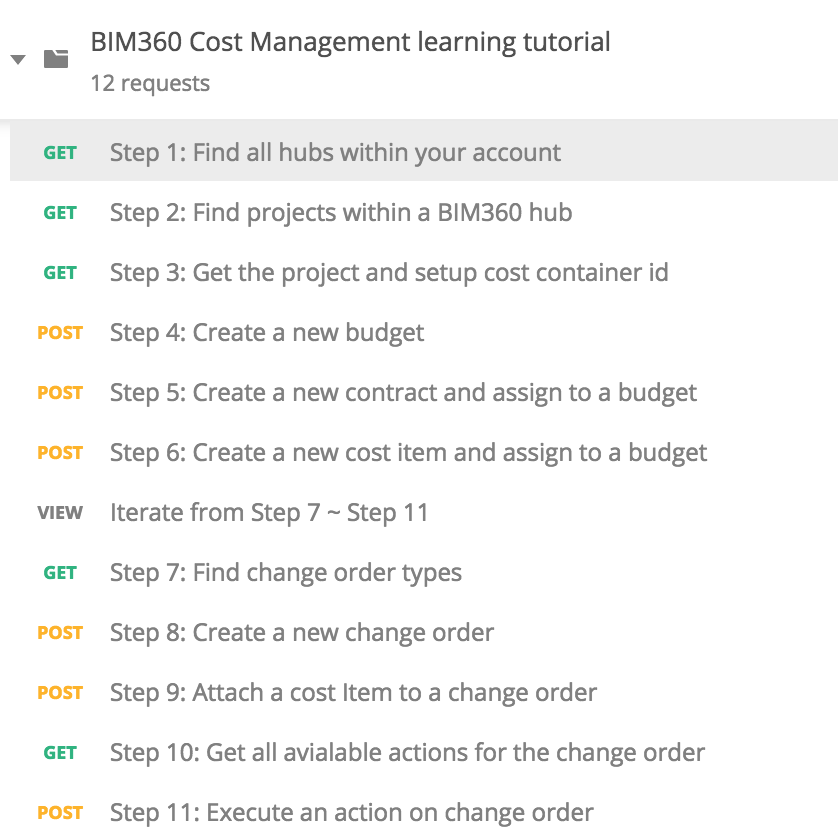
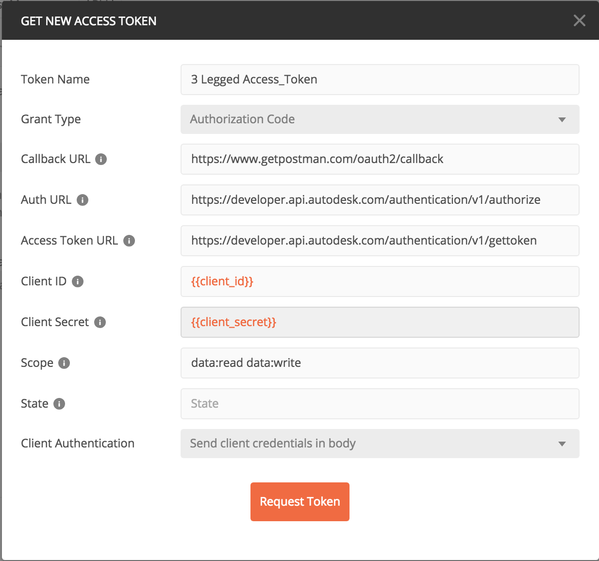
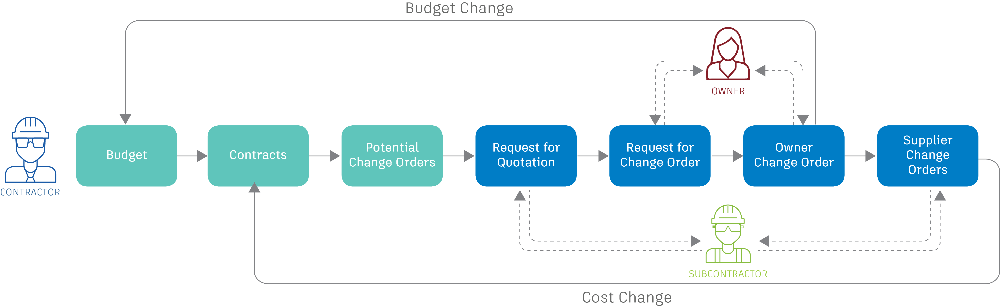

# BIM360 Cost Management Step-by-Step Tutorial

This folder contains a Postman Collection that contains the requests cover the current main workflow of BIM360 Cost Management. The collection together with the environment shows you how to create a new budget with contract, create a cost item, and create different change orders then attach to the cost item, you can also use the available "Action" applied on the change order to change the status of the change order.

## Instructions to run the Postman tutorial are as below:

### Preparation before you begin:
- [Create Forge App, get access to a BIM 360 Account](https://forge.autodesk.com/en/docs/bim360/v1/tutorials/getting-started/get-access-to-account/)
- [Create BIM360 project, activate Cost Management module, setup project for Cost Management](https://help.autodesk.com/view/BIM360D/ENU/?guid=BIM360D_Cost_Management_getting_started_with_cost_management_html);

### Setup Postman environment and Authorization:
- Import Postman environment & collection, please setup the following environment vialables, 
    - client_id:     Forge App Id.
    - client_secret: Forge App Secrect. 
    - project_name:  The project name that you want to operate on.

- Please add the Authorization for the collection, click **Edit Collection**, go to **Authorization** tab, make sure to use **OAuth 2.0** to get a 3 legged token, use it in the **Request Headers**.

    - Callback URL: https://www.getpostman.com/oauth2/callback
    - Auth URL: https://developer.api.autodesk.com/authentication/v1/authorize 
    - Access Token URL: https://developer.api.autodesk.com/authentication/v1/gettoken

### Tutorials of BIM360 Cost Management workflow
- Step 1: List all the Hubs, and save **hub_id** for the 1st BIM360 Hub, also save **account_id** (Data Management API)
- Step 2: List all the projects in the BIM360 Hub, and save **project_id** for the specified project(Data Management API).
- Step 3: Get the information of the specified BIM360 project, and save **cost_container_id** for the Cost Container(Data Management API).
- Step 4: Create a new budget, make sure your budget code follow the rule of budget code template which is set in BIM360 Cost Management project setting. Save **budget_id** for the budget you just created.
- Step 5: Create a new contract, make sure you assign the previously created budget to the contract. Save **contract_id** for the contract you just created.
- Step 6: Create a new cost item, make sure it's assigned to the budget you created before. Save **costItem_id** for the cost item you just created.

So far, you created a budget, contract, cost item, and also created the relationship among cost item, budget, contract. Next we can iterate step 7 ~ step 11 to create different change orders(PCO-RFQ-RCO-OCO-SCO) and perform actions on them based on the workflow.

- Step 7: List all the change order types and change the index to set **changeOrder_type** to the type you want create and perform within this iteration.

- Step 8: Create a new change order of the specified type, for RFQ|SCO, make sure the change order is assigned to the contract same as cost item. Save **changeOrder_id** for the new created change order.

- Step 9: Attach the change order with cost item.

- Step 10: Get all the avialable actions for this change order, save **action_name** for the action you want to perform later.

- Step 11: Execute the action on the change order, and you can go to Step 10 to check the avialable actions and execut again until you are satisfied. 

`NOTE:` You can itereate step 10 & 11 to get and execute different avialable actions to the change order. 

Until now, you should have successfully created a change order with right status, if you want to generate a following change order, you can iterate from Step 7 ~ Step 11 again, you can reference [BIM360 Cost Management Doc](http://help.autodesk.com/view/BIM360D/ENU/?guid=BIM360D_Cost_Management_change_orders_html) for the typic workflow.

## License
This sample is licensed under the terms of the [MIT License](http://opensource.org/licenses/MIT). Please see the [LICENSE](LICENSE) file for full details.

## Written by
Zhong Wu [@johnonsoftware](https://twitter.com/johnonsoftware), [Forge Partner Development](http://forge.autodesk.com)
