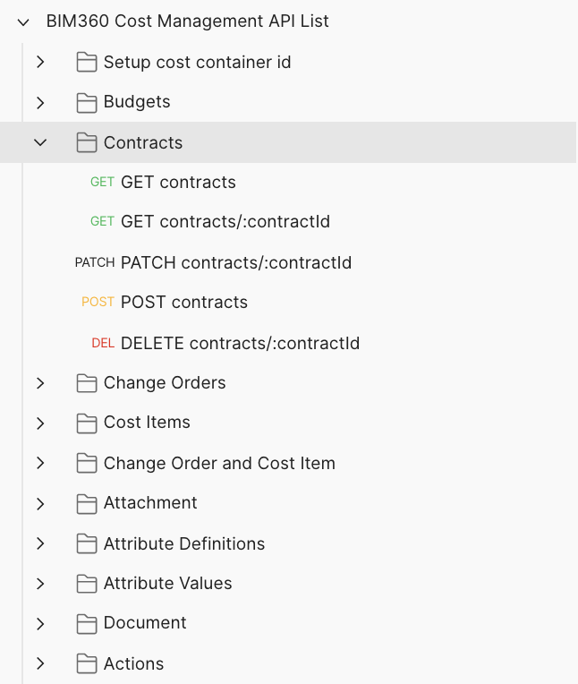

# BIM360 Cost Management API List

This folder contains a Postman Collection that includes all the current BIM360 Cost Management API Beta(2020-01-17). The collection together with the environment help you easily test these endpoints.

## Instructions to run the Postman collection are as below:

### Preparation before you begin:
- [Create Forge App, get access to a BIM 360 Account](https://forge.autodesk.com/en/docs/bim360/v1/tutorials/getting-started/get-access-to-account/)
- [Create BIM360 project, activate Cost Management module, setup project for Cost Management](https://help.autodesk.com/view/BIM360D/ENU/?guid=BIM360D_Cost_Management_getting_started_with_cost_management_html);

### Setup Postman environment and Authorization:
- Import Postman environment & collection, please setup the following environment vialables, 
    - client_id:     Forge App Id.
    - client_secret: Forge App Secrect. 
    - project_name:  The project name that you want to operate on.

- Please add the Authorization for the collection, click **Edit Collection**, go to **Authorization** tab, make sure to use **OAuth 2.0** to get a 3 legged token, use it in the **Request Headers**.

    - Callback URL: https://www.getpostman.com/oauth2/callback
    - Auth URL: https://developer.api.autodesk.com/authentication/v1/authorize 
    - Access Token URL: https://developer.api.autodesk.com/authentication/v1/gettoken

### Use the endpoints under **Setup cost container id** to set cost_container_id, then you can play with any Endpoint as you want.

## Tips & Tricks
- These endpoints are mainly used to quick test|verfify based on your good understanding to cost module and API, the individual endpoint may not work, you need to set up the environment variables before running the Postman request.

## License
This sample is licensed under the terms of the [MIT License](http://opensource.org/licenses/MIT). Please see the [LICENSE](LICENSE) file for full details.

## Change History
- Removed [**GET File Package Endpoint**](https://forge.autodesk.com/en/docs/bim360/v1/reference/http/cost-file-packages-GET/) since it was only included in public beta, and was deprecated during public release.

## Written by
Zhong Wu [@johnonsoftware](https://twitter.com/johnonsoftware), [Forge Partner Development](http://forge.autodesk.com)
