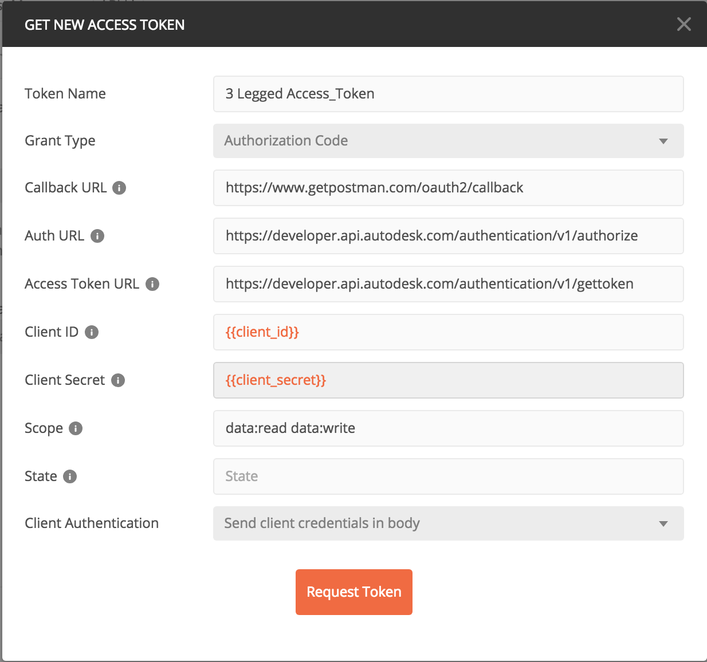

# BIM360 Cost Management Postman collection
 Postman collection to show how to do basic API operation on BIM360 Cost Management module

Preparation before using Postman collection:
1. Create BIM360 project and activate Cost Management module;
2. Project setting for Cost management;

 The collection together with the environment shows you how to create a new budget with contract, and also create a change order with a couple of cost items, then you can use the available "Action" applied on the change order to change the status of the change order.

Steps to operate with the endpoints:
1. Before using the collection, please add the Authorization for the collection, click "Edit Collection", go to "Authorization" tab, make sure to use "OAuth 2.0" to get a 3 legged token, and use it in the "Request Headers".

2. Follow step 1 to step 5 to create a budget which assigned to a contract, also create a cost item that will be attached to change orders in the following step.

3. Iterate to do step 6 ~ step 11 to create different change order and perform action on that.
